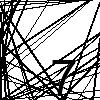

# Captcha GIF generator

This is a python based GIF generator which generate GIF containing sequence of number as captcha



## Getting Started

To generate GIF you need to checkout the project and add pillow library needed by generate_captcha.py the library can be added by using pip
```
pip install Pillow
```

Now after installing Pillow run the captcha_genrate.py script which will genrate the captcha
```
python create_captcha.py
```

### Advantages of GIF as captcha

1. For bot to read captcha which is GIF is bit difficult as it has to capture a frame and then extract the number from the frame. It can capture two consecutiveframe and assume it to be captcha digit
2. For each digit of capctha we have added rotation to it so the digit while extracting the frame by bot will be difficult to find
3. We have added random lines or edges in the frame so find a linking edge for digit recognition would be a difficult for the bot
4. Each digit comes one after other so the actual user need to add digit in any sequence as they appear in the verify box and your backend logic should find extact sequence of number in the digit entered by user
 
